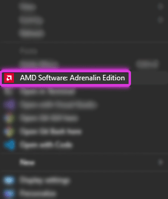
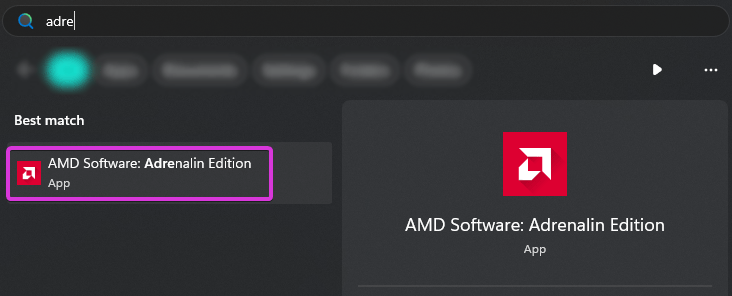
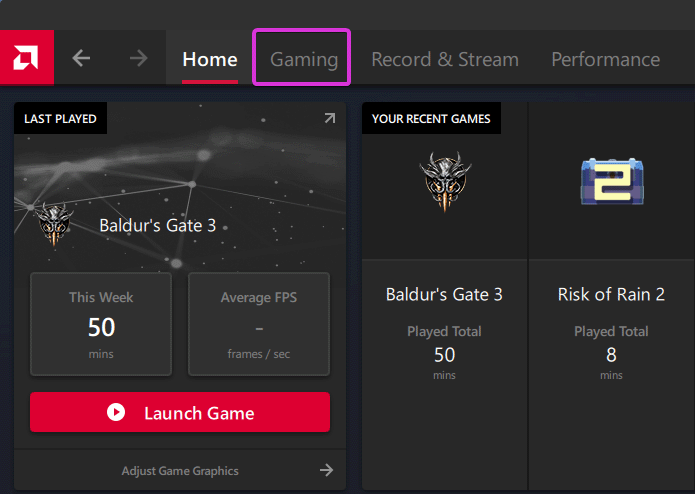
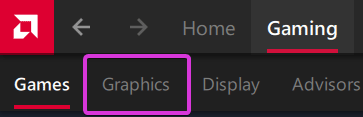
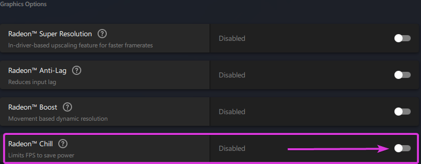
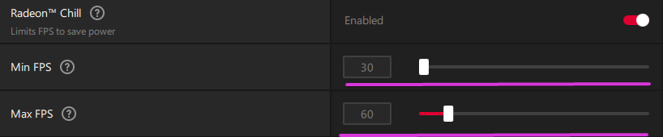

# Limiting your game's framerate.

While having the highest FPS can be seen as a good thing, it often comes with the side effect of not allowing shaders breathing room in ReShade.

This guide will take you down the various paths of how to limit your framerate, both globally and locally!

-----------------

## AMD Adrenalin Global (Driver Based, AMD GPU Only, All Games)
This guide will provide you with the basics to limit your framerate using AMD Adrenalin's, Radeon Chill feature globally (all games are affected.)

### Step 1 - Opening AMD Adrenalin
Open AMD Adrenalin:
* __Easiest Method__ - Right click your desktop wallpaper, and click `AMD Software꞉ Adrenalin Edition`.
    

     
* Alternative Method - Search `Adrenalin` in the Windows Search Bar.
    

     

-----------------

### Step 2 - Enabling "Radeon Chill"
1. Click `Gaming` on the top most bar of the `Adrenaline` software.
    

     
2. Then click `Graphics` in the second bar.
    

     
3. Scroll down to the `Graphics Options` portion of the `Graphics` tab and enable `Radeon Chill`.
    

     
4. Tune `Radeon Chill` to have the maximum and minimum FPS desired.
    

     

-----------------

