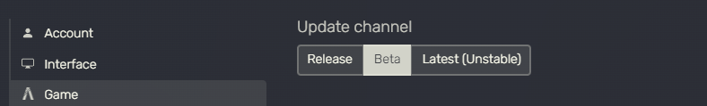

{: .highlight-title}
> **IMPORTANT:**
> 
>As of Aug. 06.2023, FiveM has released an update to their client in order to block version 5.9 and above. Unfortunately this had also blocked the hotfix specifically for the crashing that they are trying to prevent.
>
>At the current time of Aug 08.2023 - this blocking still has not been removed. However, they have pushed an update to the beta and latest Release Channel in order to remove the blocking for 5.9.1 users.
>
>Meaning that you should switch your FiveM Release Channel over to Beta, or Latest, and then install the latest version of ReShade on [ReShade's website](https://reshade.me). - Jordan Brady Aug.08.2023
>

>
>

>Installing the latest update is the same process as previous, see below.

----------------

## Installing ReShade to FiveM

#### Step 1 
Start by installing ReShade to GTAV. 
You will likely want the addon-support build of ReShade from the [ReShade website](https://reshade.me).

{: .warning}
You must install ReShade to `GTA5.exe` 
Installing ReShade to the launcher will give you the wrong binary, and won't allow ReShade to inject properly.

----------------

#### Step 2
Once ReShade is installed to GTAV, navigate to your GTAV folder. 
You should see:

* `dxgi.dll`
* `reshade.ini`
* `ReShade-Shaders`

{: .note}
These files belong to ReShade, and are **needed** for Step 5. 
Do not close this folder!

----------------

#### Step 3.
Navigate to the location of your FiveM install.

{: .note}
The **default** is `C:\Users\{USERNAME}\AppData\Local\FiveM`. 
The location of your install of FiveM **might** slightly differ.

----------------

#### Step 4
**Create** a `plugins` folder in the `FiveM Application Data` folder.

{: note}
Skip if this step is already there

----------------

#### Step 5
Drag and drop the two files and singular folder, that were listed above in Step 2., into your newly created `plugins` folder.

----------------

#### Step 6
Boot up FiveM and verify that ReShade has launched and all of your shaders are present.

----------------

## Possible errors if done wrong
`Ignored graphics mod \Grand Theft Auto V\dxgi.dll - these should go in plugins/ now!` 
If this error occurs - you likely have not dropped ReShade into the `plugins` folder of your FiveM install directory - or you still have existing mod injections in your GTAV folder - THIS TUTORIAL WAS MEANT SPECIFICALLY FOR RESHADE, BUT THE SAME METHODS CAN APPLY FOR OTHER MODIFICATIONS.

{: .warning}
If you get any errors relating to using 5.9 or above, you likely have not switched your FiveM Release Channel over to Beta, or Latest, or you are not using the latest version of ReShade!
